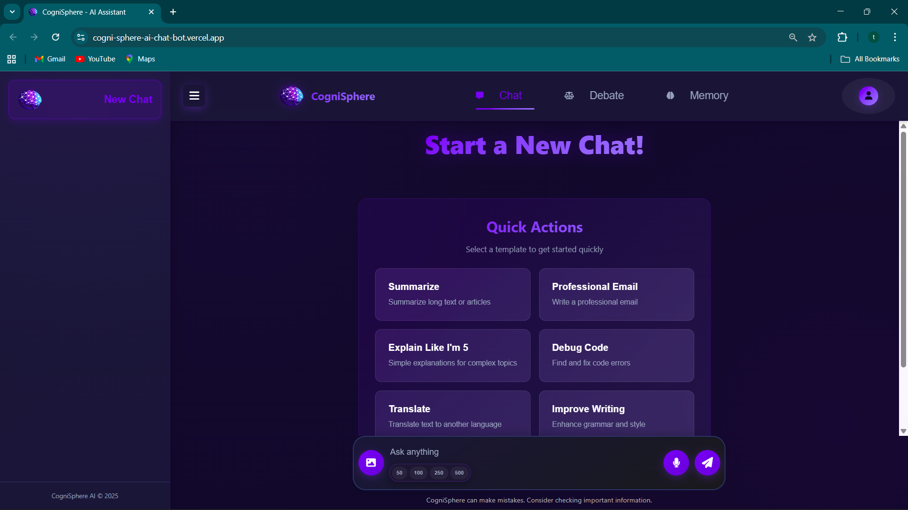

# 🌐 CogniSphere AI

CogniSphere AI is a full-stack MERN chatbot application featuring AI personas,
multi-threaded conversations, and debate-style interactions using Groq LLaMA models.

## 🚀 Key Features
- AI-powered chatbot with multiple personas
- Debate mode with AI vs AI discussions
- Multi-threaded chat management
- Persistent conversation memory
- Secure authentication using JWT

## 🛠 Tech Stack
**Frontend:** React, Vite  
**Backend:** Node.js, Express  
**Database:** MongoDB  
**AI:** Groq API (LLaMA models)

## 🔗 Live Demo
🌐 **Frontend:** https://cogni-sphere-ai-chat-bot.vercel.app  
📡 **Backend API:** https://cognisphere-ai-chatbot.onrender.com

## 📸 Screenshots

### Login & Authentication

### Chat Interface with AI Personalities

### AI Debate Mode

### Image Analysis & Personality Selection

### Personal Knowledge Base

## 📂 Documentation
For detailed architecture, API routes, security, and implementation details:  
📘 **[PROJECT_DOCUMENTATION.md](PROJECT_DOCUMENTATION.md)**

## 👩‍💻 Author
**Thanushree K P**  
GitHub: [@Thanushreekp22](https://github.com/Thanushreekp22)

---

⭐ **Star this repository if you find it helpful!**

